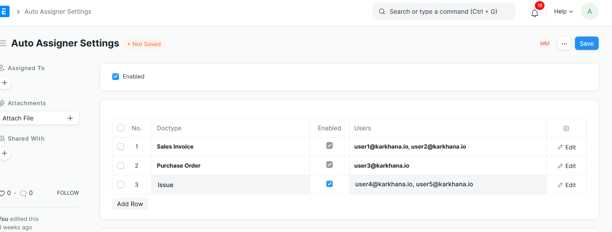

## Auto Assigner

App to auto assign users to documents upon creation.

## Set Up and Usage

1. Open Auto Assigner Settings Doctype

2. Enable it

3. In the table below, select the doctype, enable it for that specific doctype, type in the users to whom the document should be shared upon creation. it should be be in comma delimited format, without a trailing comma at the end

   ​	Eg : user1@karkhana.io, user2@karkhana.io

   

`To disable the entire auto assigner, just untick the enabled at the top of the auto assigner settings, to disable it for individual doctype, either delete the entry from the table or untick the enabled for that row`

#### License

MIT